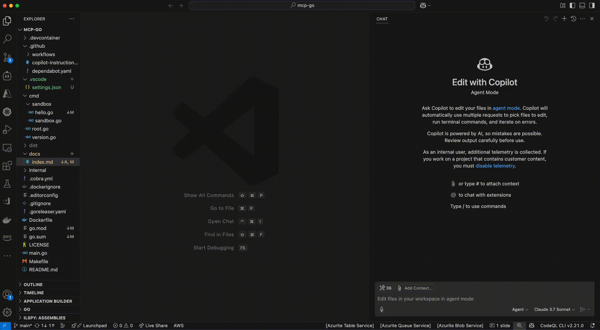

# MCP Go

## Run calculator example

1. `cmd` + `shift` + `p` to open the command palette
2. Type `MCP: List Servers`
3. Select `hello` from the list
4. Select `MCP: Start Server`
5. From chat view, select `Agent` from the dropdown
6. Type `Please calculate 1+2 from Tool`
7. GitHub Copilot will prompt you to get an approval
8. Type `yes` to approve the request
9. The result `3` will be returned in the chat view



## Inspector tool

See [Tutorial > Inspector](https://modelcontextprotocol.io/docs/tools/inspector) for more information.

```shell
# Run inspector tool directly
npx @modelcontextprotocol/inspector
```

# References

## Get started

- [modelcontextprotocol/specification](https://github.com/modelcontextprotocol/specification): The specification of the Model Context Protocol
- [MCP に入門する/ Introduction to MCP](https://speakerdeck.com/shuntaka/introduction-to-mcp)
- [mark3labs/mcp-go](https://github.com/mark3labs/mcp-go): A Go implementation of the Model Context Protocol (MCP), enabling seamless integration between LLM applications and external data sources and tools.
- [github/github-mcp-server](https://github.com/github/github-mcp-server): GitHub's official MCP Server
- [Go の Model Context Protocol (MCP)の開発フレームワーク mcp-go を使ってみる](https://zenn.dev/uji/articles/try-mpc-development-mcp-go)
- [modelcontextprotocol/inspector](https://github.com/modelcontextprotocol/inspector): Visual testing tool for MCP servers
- [Part1 : Azure AI Foundry で MCP を使ってみた【深掘りと最新動向調査】](https://zenn.dev/chips0711/articles/e71b088f26f56a)
- [Part2 : Azure AI Foundry で MCP を使ってみた【深掘りと最新動向調査】](https://zenn.dev/chips0711/articles/ba72417a1f6c34)
